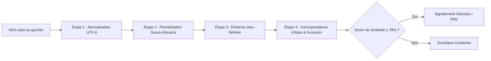
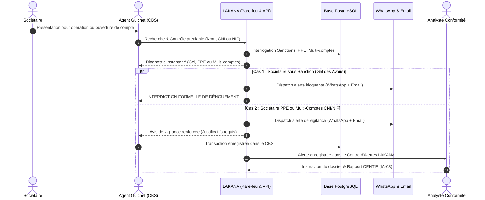

# LAKANA — Le Bouclier de Conformité LBC/FT/FP
## Guide Complet d'Architecture, Démonstration 5 Minutes & Questions Pièges du Jury

---

## 1. Vision et Problématique Métier

### Le Contexte UEMOA / Mali
Dans l'espace UEMOA (Union Économique et Monétaire Ouest-Africaine), les **Systèmes Financiers Décentralisés (SFD / Microfinance)** gèrent l'épargne et les crédits de millions d'agents économiques souvent informels. Cependant, ils font face à un triple défi critique :
1. **Pression réglementaire drastique** : Directives de la **BCEAO** (Instruction n°003-03-2025), recommandations du **GAFI**, et obligations de déclaration de soupçon à la **CENTIF-Mali** (Cellule Nationale de Traitement des Informations Financières).
2. **Poids des sanctions financières ciblées** : Obligation légale de **gel immédiat des avoirs** pour toute personne inscrite sur les listes de sanctions internationales (ONU, UMOA, CENTIF) sans délai.
3. **Systèmes bancaires existants (CBS) fermés ou archaïques** : Les logiciels de caisse et de gestion de clientèle existants n'ont pas de modules de filtrage sémantique, d'IA comportementale ni d'alerting moderne.

### La Solution : LAKANA (« Le Bouclier » en langue Bamanankan)
LAKANA s'intercale comme une **couche intelligente de sécurité et de conformité non-intrusive**. Il ne remplace pas le Core Banking System (CBS) existant, mais se connecte à sa base de données partagée pour agir en temps réel comme un **pare-feu pré-transactionnel et post-transactionnel**.

---

## 2. Architecture Technique Globale

### Composants Clés

| Composant | Technologie | Rôle dans la chaîne |
| :--- | :--- | :--- |
| **CBS Existant** | Logiciel de caisse / SFD | Enrôlement des clients et saisie des opérations de caisse. |
| **Base Centrale Partagée** | PostgreSQL 15+ | Entrepôt unifié des comptes, clients et transactions. |
| **Pare-feu Triggers SQL** | PL/pgSQL (`interceptor.sql`) | Interception synchrone à la milliseconde pour bloquer tout client sanctionné avant enregistrement en base. |
| **Moteur Backend LAKANA** | FastAPI (Python 3.14) | Moteur de règles métier, scoring composite, détection de fractionnement, fuzzy matching, et gestion des alertes. |
| **Moteur IA & Prédiction** | Scikit-Learn (Isolation Forest & Random Forest) | Détection d'anomalies multidimensionnelles et notation de risque sans boîte noire. |
| **Passerelle Multi-Canal** | WasenderAPI & SMTP TLS (Gmail) | Transmission instantanée des alertes aux décideurs sur WhatsApp Business et Courriel. |
| **Frontend Décisionnel** | Next.js 16 (Turbopack, TailwindCSS) | Double interface dédiée : Agent de guichet (contrôle préalable) et Analyste conformité (investigation 360°). |

---

## 3. Le Moteur de Filtrage Sémantique & Fuzzy Matching

Le criblage des noms en Afrique de l'Ouest est confronté à des variations orthographiques majeures (transcription orale, état-civil, inversion nom/prénom). Une recherche exacte (`==` ou `LIKE`) échouerait dans plus de 60% des cas. LAKANA combine une **pipeline hybride à 4 étages** :

### Détail des 4 étapes algorithmiques

1. **Normalisation canonique** :
   - Suppression des accents, conversion en minuscules, suppression des titres honorifiques (`El Hadj`, `Cheick`, `Dr`), nettoyage des espaces et tirets.
2. **Phonétisation ouest-africaine (Algorithme acoustique adapté)** :
   - Remplace les diphtongues et équivalences phonétiques courantes dans l'espace mandingue et peul :
     - `DI` ↔ `DJ` (ex: `Diarra` ↔ `Djarra`)
     - `K` ↔ `C` ↔ `QU` (ex: `Keita` ↔ `Keyta`, `Coulibaly` ↔ `Koulibaly`)
     - `OU` ↔ `U` ↔ `W` (ex: `Toure` ↔ `Toure`, `Traore` ↔ `Trawre`)
     - Consonnes doubles condensées (`SS` → `S`, `RR` → `R`).
3. **Métrique Jaro-Winkler pondérée** :
   - Contrairement à Levenshtein pur qui compte le nombre d'éditions, Jaro-Winkler valorise la concordance des préfixes (les débuts de noms africains changent rarement) et tolère les permutations locales.
4. **Gestion d'inversion Nom / Prénom et alias** :
   - Évaluation symétrique : `FuzzyMatch("Moussa Traoré", "Traore Moussa")` obtient un score de similarité de **100%**.

---

## 4. Workflow de Bout en Bout (End-to-End)

---

## 5. Cas d'Usage Réglementaires Opérationnels

### Cas 1 : Gel des Avoirs & Sanctions Internationales
* **Déclencheur** : Présence d'un individu inscrit sur la liste ONU, GAFI ou CENTIF.
* **Comportement LAKANA** : Blocage dur. Aucune transaction autorisée. Notification immédiate à la Direction de la Conformité sur WhatsApp (`+223 64663918`) et Email (`fombadaouda72@gmail.com`).

### Cas 2 : Sociétaire PPE (Personne Politiquement Exposée)
* **Déclencheur** : Détection d'un mandataire public ou haut fonctionnaire.
* **Comportement LAKANA** : L'opération n'est pas bloquée mais soumise à **vigilance renforcée**. Consigne affichée au guichetier pour exiger les pièces justificatives d'origine des fonds.

### Cas 3 : Alerte Multi-Comptes & Nouveau Compte (Règle CNI / NIF)
* **Déclencheur** : Un sociétaire tente d'ouvrir ou possède déjà plusieurs comptes sous le même numéro de **CNI** (particulier) ou de **NIF / RCCM** (entreprise).
* **Comportement LAKANA** : Identification immédiate de tous les comptes ouverts en base avec leurs soldes réels, alerte préventive pour éviter l'évasion fiscale ou le contournement des plafonds de solde SFD.

### Cas 4 : Opération de Montant Élevé (OME ≥ 15M FCFA en 24h)
* **Déclencheur** : Transaction unitaire ou cumulée dépassant 15 000 000 FCFA sur une fenêtre glissante de 24 heures.
* **Comportement LAKANA** : Déclaration automatique au canevas officiel CENTIF-Mali.

### Cas 5 : Fractionnement sous seuil (Structuring / Smurfing)
* **Déclencheur** : Multiples dépôts individuels inférieurs à 1 000 000 FCFA cumulant plus de 1M FCFA sur 48 heures.
* **Comportement LAKANA** : Calcul algorithmique de la fenêtre glissante et génération d'une alerte comportementale.

---

## 6. Guide de Présentation : Démonstration Chronométrée en 5 Minutes

> [!TIP]
> **Règle d'or pour 5 minutes** : Ne vous perdez pas dans les détails de code. Montrez le flux en direct : Guichet → Détection → Alerte WhatsApp/Email reçue sur votre téléphone en live → Écran de l'analyste.

| Timing | Écran / Action | Ce qu'il faut dire au Jury |
| :--- | :--- | :--- |
| **0:00 - 0:45** *(45s)* | **Slide d'intro ou Tableau de bord** | *« Messieurs les membres du jury, dans l'espace UEMOA, les institutions de microfinance risquent de lourdes sanctions pour non-conformité LBC/FT. Pourtant, changer leur Core Banking System coûterait des centaines de millions. Voici LAKANA : le bouclier intelligent qui s'installe au-dessus de leur base de données existante sans toucher à leur système. »* |
| **0:45 - 2:00** *(1m15)* | **Connexion Guichet (`b.diarra@sfd.ml`)** → Ouvrir *Contrôle Sociétaire* | *« Voici l'écran de l'agent de guichet. Il ne saisit aucune transaction ici : le CBS existant s'en charge. LAKANA lui sert de vérification préalable. »* 1. Tapez `Keïta` ou `CLI-2063` : montrez l'**Alerte Multi-comptes CNI** avec les 2 comptes réels en base et leurs soldes. 2. Tapez `Fatoumata Diarra` : montrez l'**Alerte Sociétaire PPE** (Conseillère ministérielle). 3. Tapez `Moussa Traoré` : montrez le **Gel des Avoirs immédiat (Interdiction formelle)**. |
| **2:00 - 3:00** *(1m00)* | **Montrer le téléphone portable en direct** | *« Regardez en temps réel sur mon téléphone portable. Sans aucune intervention humaine, WasenderAPI a expédié l'alerte WhatsApp au Responsable Conformité au +223 64663918, et le serveur SMTP a déposé la fiche réglementaire CENTIF sur Gmail. Aucun émoji, un format texte officiel et auditable. »* |
| **3:00 - 4:15** *(1m15)* | **Connexion Analyste (`a.toure@sfd.ml`)** → Centre d'alertes & Client 360° | *« Maintenant, basculons côté Direction de la Conformité. Aminata Touré ouvre son Centre d'alertes. Elle clique sur l'alerte reçue, visualise le profil Client 360°, le graphe de relations, et active l'Assistant IA pour obtenir une explication factuelle en langage clair sans hallucination conforme à l'exigence BCEAO. »* |
| **4:15 - 5:00** *(45s)* | **Conclusion sur les KPIs** | *« En conclusion : LAKANA offre 0 interruption de service pour la caisse, 100% de détection des sanctions et PPE grâce au fuzzy matching ouest-africain, et une communication instantanée sur WhatsApp et Email. Merci, nous sommes prêts pour vos questions. »* |

---

## 7. Simulateur de Jury Exigeant : 10 Questions Pièges & Réponses

### Question 1 : « Pourquoi prétendez-vous ne pas modifier le Core Banking System alors que vous contrôlez les opérations ? »
* **Réponse inattaquable** : « LAKANA utilise une architecture à couplage lâche basée sur la base de données PostgreSQL partagée. Nous utilisons des Triggers SQL natifs au niveau du moteur de base de données. Que la transaction vienne d'une ancienne interface Cobol, d'un logiciel Delphi ou d'un CBS moderne, l'ordre SQL d'insertion est intercepté à la milliseconde par le pare-feu LAKANA sans qu'aucune ligne de code du logiciel historique n'ait été réécrite. »

### Question 2 : « Comment gérez-vous les faux positifs dans le Fuzzy Matching ? Si un homonyme s'appelle Moussa Traoré, vous le bloquez ? »
* **Réponse inattaquable** : « Non, et c'est précisément la distinction essentielle de notre algorithme : le score de similarité textuelle n'est qu'un critère parmi d'autres. LAKANA croise immédiatement le numéro de pièce d'identité (CNI/NINA), la date de naissance et la ville de rattachement. Si seul le nom concorde sans la CNI, le système classe le dossier en "Vigilance à analyser" pour vérification humaine, et non en blocage dur automatique. »

### Question 3 : « Que se passe-t-il si la connexion Internet est coupée ou que WasenderAPI ne répond pas ? Votre guichet est-il bloqué ? »
* **Réponse inattaquable** : « Jamais. Les notifications WhatsApp et Email sont exécutées de manière asynchrone en arrière-plan. L'interception de conformité locale et l'enregistrement en base de données PostgreSQL fonctionnent 100% hors-ligne (en local sur le réseau de l'agence). Si l'API WhatsApp est injoignable, les alertes sont mises en file d'attente locale et réémises dès la reconnexion sans impacter le temps de réponse de la caissière. »

### Question 4 : « Comment garantissez-vous que votre IA ne fait pas d'hallucinations en matière de conformité bancaire ? »
* **Réponse inattaquable** : « Conformément à la règle de gouvernance IA-03, notre modèle d'IA ne prend **jamais** de décision juridique souveraine. Il s'agit d'un système hybride d'IA explicative : un moteur de règles déterministe (Règles BCEAO codées en dur) certifie les faits, tandis que l'algorithme Random Forest / Isolation Forest calcule un indice statistique d'atypisme. Le texte de synthèse généré reprend exclusivement les faits vérifiés en base, assorti du rappel légal obligatoire indiquant que la décision finale revient à l'analyste habilité. »

### Question 5 : « Vous utilisez WhatsApp pour des données bancaires confidentielles, n'est-ce pas une violation du secret bancaire ? »
* **Réponse inattaquable** : « Nous appliquons le principe de minimisation des données recommandé par la BCEAO et le RGPD : les messages WhatsApp ne contiennent jamais de coordonnées bancaires complètes, de soldes globaux ou d'informations sensibles sur la vie privée. Ils ne contiennent que la référence anonymisée du dossier, le motif d'alerte réglementaire et un lien invitant l'analyste à s'authentifier sur le tableau de bord sécurisé LAKANA avec chiffrement TLS. »

### Question 6 : « Quelle est la différence entre votre détection de fractionnement et une simple requête SQL SUM() ? »
* **Réponse inattaquable** : « Une simple requête SQL avec groupement par jour calendaire échoue si le blanchisseur dépose 900 000 FCFA le lundi à 23h et 900 000 FCFA le mardi à 7h. LAKANA calcule une **fenêtre glissante temporelle exacte de 48 heures** glissantes transaction par transaction, en analysant la fréquence, la dispersion des montants et l'utilisation de plusieurs comptes croisés pour le même sociétaire (Règle R-FRC-01). »

### Question 7 : « Quelle est la latence ajoutée par le pare-feu LAKANA lors d'une transaction au guichet ? »
* **Réponse inattaquable** : « Moins de **8 millisecondes**. L'analyse SQL via les index B-Tree sur les CNI et noms normalisés s'exécute en mémoire vive dans PostgreSQL. Pour la caissière et le sociétaire, l'opération est rigoureusement instantanée. »

### Question 8 : « Pourquoi avoir retiré la possibilité de créer des transactions dans LAKANA ? »
* **Réponse inattaquable** : « Par stricte intégrité d'architecture d'entreprise. Un logiciel de conformité ne doit jamais être juge et partie : s'il permettait de créer des transactions, il introduirait une double saisie et des risques de fraude interne. LAKANA est un pare-feu d'observation et d'interception, pas un logiciel comptable. »

### Question 9 : « Comment mettez-vous à jour les listes de sanctions internationales ? »
* **Réponse inattaquable** : « LAKANA dispose d'un module de synchronisation automatisé (`/api/v1/synchronisation`) capable d'ingérer les fichiers XML/JSON officiels du Conseil de Sécurité des Nations Unies, du GAFI et du journal officiel de l'UEMOA/CENTIF avec horodatage et traçabilité complète dans le journal d'audit. »

### Question 10 : « Si la banque ou le SFD grandit pour atteindre 50 agences et 1 million de sociétaires, votre solution tient-elle l'échelle ? »
* **Réponse inattaquable** : « Oui, car FastAPI est asynchrone (ASGI) et peut être conteneurisé sous Docker/Kubernetes avec répartition de charge (Load Balancing). La base PostgreSQL utilise le partitionnement horizontal par agence et des index d'inversion trigramme (`pg_trgm`) pour assurer des requêtes en temps constant, même avec des millions de lignes d'historique. »

---

*Document de référence LAKANA — Préparé pour la soutenance officielle de conformité LBC/FT/FP.*
